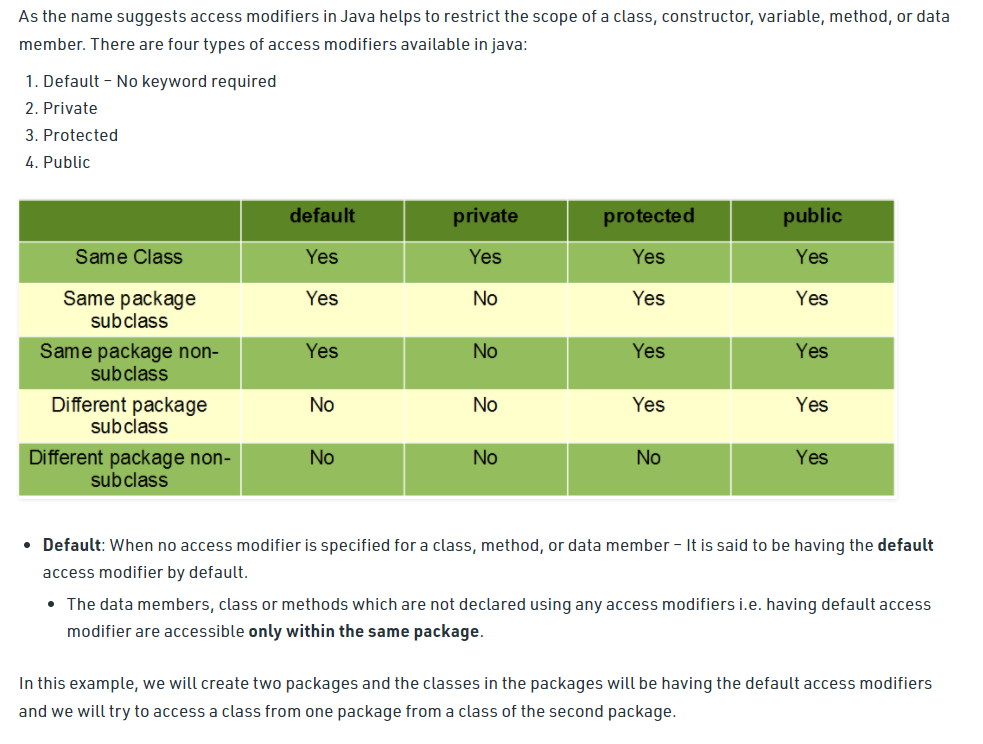

= Scope

Scope refers to the visibility in a class, member, or variable!

'''

Variable's levels of scope (from inside to outside):
for loop
method
class level

'''

methods and classes has also scopes

If innerClass exists in a Class, first uses the innerClass variables, and then the main class variables!

Access modifiers:

- public
- protected
- default - no keyword required (so-called package private)
- private

https://www.geeksforgeeks.org/access-modifiers-java/

'''

Protected:

When a variable, method or constructor that are declared protected in a superclass can be accessed only by the subclasses in other package or any class within the package of the protected members' class.

The protected access modifier cannot be applied to class and interfaces. Methods, fields can be declared protected, however methods and fields in a interface cannot be declared protected.

Protected access gives the subclass a chance to use the helper method or variable, while preventing a non-related class from trying to use it.

'''

If a Class has a private variable inner class can reach and see it!